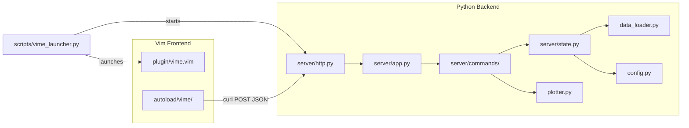

# VIME - Vim H5 File Viewer

A fast, lightweight HDF5 file viewer using Vim as the frontend and a persistent Python HTTP backend. Data is loaded once into memory, so browsing tables, viewing metadata, and plotting is instant.

## Architecture


```mermaid
flowchart LR
    subgraph vim [Vim Frontend]
        Plugin[plugin/vime.vim]
        Autoload[autoload/vime/]
    end
    subgraph py [Python Backend]
        HTTP[server/http.py]
        App[server/app.py]
        State[server/state.py]
        Commands[server/commands/]
        DataLoader[data_loader.py]
        Plotter[plotter.py]
        Config[config.py]
    end
    Launcher[scripts/vime_launcher.py] -->|starts| HTTP
    Launcher -->|launches| Plugin
    Autoload -->|"curl POST JSON"| HTTP
    HTTP --> App
    App --> Commands
    Commands --> State
    State --> DataLoader
    State --> Config
    Commands --> Plotter
```

The Python backend runs as a separate localhost HTTP server started by the launcher script. Vim communicates with it using `curl` for all requests (JSON payloads over HTTP POST). The H5 file is opened once and kept in memory by the backend, making subsequent table loads, plots, and info queries fast. Because the backend is a separate process, crashes in Python do not affect Vim.

The backend is a **persistent, shared daemon**: it is started lazily on the first `vime` launch, kept running across Vim sessions (so opening files after the first is instant), and shared by every Vim instance. Each open file gets its own isolated **session** on the server (keyed by file path), so viewing several files at once never mixes their state. The daemon reaps itself after a configurable idle period (`VIME_IDLE_TIMEOUT`); while any VIME buffer is open, Vim sends a lightweight keepalive ping to prevent the idle timeout from firing. Heavy Python imports (pandas, h5py, numpy, etc.) are deferred until first use to keep startup fast.

## Requirements

- **Vim** with JSON support (`+json`) for `json_encode()` / `json_decode()`
- **curl** available on PATH
- **Python 3.6+**
- Python packages: `h5py`, `pandas`, `numpy`, `tabulate`, `tables`

## Installation

1. Install the Python dependencies:

```bash
pip install -r requirements.txt
```

2. Add VIME to your Vim runtime path. Add this line to your `~/.vimrc`:

```vim
set runtimepath+=~/path/to/VIME
```

Replace `~/path/to/VIME` with the actual path to this directory.

3. Add the wrapper to your PATH (recommended), or use it directly:

```bash
export PATH="$PATH:/path/to/VIME/scripts"
```

On Windows PowerShell:

```powershell
$env:Path = "$env:Path;C:\path\to\VIME\scripts"
```

4. Restart Vim or run `:source ~/.vimrc`.

## Usage

### Opening an H5 File

Start VIME via the wrapper so the HTTP server is running:

```bash
vime data.h5
```

VIME intercepts the open command and displays a list of all tables in the file.

You can also open a file from within Vim:

```vim
:VimeOpen /path/to/data.h5
```

### Wrapper Configuration

The wrapper and plugin use these environment variables (optional):

- `VIME_HTTP_HOST` (default: `127.0.0.1`)
- `VIME_HTTP_PORT` (default: `51789`, used as the starting port)
- `VIME_HTTP_PORT_RETRIES` (default: `100`, number of incremental ports to try)
- `VIME_PYTHON` (default: `python3` or `python` on Windows)
- `VIME_IDLE_TIMEOUT` (default: `900` seconds; set to `0` to disable. The daemon shuts itself down after this many seconds with no requests.)
- `VIME_MAX_SESSIONS` (default: `16`. Maximum number of files kept open in memory at once; the least-recently-used file's handles are closed beyond this, and reopened transparently on next access.)

When the backend starts, it first tries `VIME_HTTP_PORT`. If that port is in use, it increments by one until it finds an open port (up to `VIME_HTTP_PORT_RETRIES` attempts). The launcher reuses an already-running healthy daemon when it finds one, so the second and subsequent `vime` launches attach to the existing process instead of paying startup cost again.

The Vim keepalive interval can be tuned with `g:vime_keepalive_ms` (default `120000`, i.e. 2 minutes); keep it well under `VIME_IDLE_TIMEOUT`.

PowerShell helper:

```powershell
Set-Alias vime "C:\path\to\VIME\scripts\vime.ps1"
```

### Table List View

When you open an H5 file, you see a list of all tables with their dimensions:

```
 VIME - data.h5
 ============================================================

 Tables:

   /experiment/results                      (1000 rows x 5 cols)
   /experiment/metadata                     (1 rows x 12 cols)
   /summary                                 (50 rows x 3 cols)
```

**Keybindings:**

| Key       | Action                              |
|-----------|-------------------------------------|
| `<Enter>` | Open the table under the cursor     |
| `,gv`     | Open table in a vertical split      |
| `,gh`     | Open table in a horizontal split    |
| `,s`      | Open `config.json`                  |
| `,i`      | Show info (shape, dtypes, summary)  |
| `,r`      | Refresh the table list              |
| `,c`      | Start a background compute job      |
| `,q`      | Close this Vim's VIME buffers (the shared daemon keeps running) |

### Table Content View

Shows the table data formatted as a grid:

**Keybindings:**

| Key    | Action                                  |
|--------|-----------------------------------------|
| `,p`   | Plot prompt (enter column indices)      |
| `,pv`  | Plot in vertical split                  |
| `,ph`  | Plot in horizontal split                |
| `,pq`  | Close all plot buffers                  |
| `,b`   | Back to table list                      |
| `,i`   | Show table info                         |
| `,q`   | Close buffer                            |

**Commands:**

```vim
:VimePlot 1 3          " Line plot of column 1 vs column 3
:VimePlot 0 2 scatter  " Scatter plot of column 0 vs column 2
:VimePlot time value   " Plot by column name
```

### Plot View

Displays a Unicode braille plot in a new buffer. Each character cell uses a 2x4 sub-pixel braille dot grid, providing high-resolution plots directly in the terminal.

**Keybindings:**

| Key    | Action            |
|--------|-------------------|
| `,b`   | Back to table     |
| `,q`   | Close plot        |
| `,pq`  | Close plot        |

### Other Commands

```vim
:VimeInfo   " Show detailed info about the current table
```

## File Structure

```
VIME/
  autoload/vime/            Vim autoload modules
    buffer.vim                 Scratch buffer creation and border wrapping
    colors.vim                 Nord-based highlight groups and syntax rules
    http.vim                   HTTP client layer (curl-based)
    info.vim                   Table metadata display
    list.vim                   Table list buffer and compute polling
    nav.vim                    Navigation and buffer lifecycle
    plot.vim                   Plot buffer management
    state.vim                  Key-value plugin state store
    table.vim                  Table data display
  plugin/
    vime.vim                 Vim plugin entry point (commands, autocommands)
  python/
    vime_server.py           Backend HTTP server entry point
    config.py                Per-table column ordering (config.json)
    data_loader.py           HDF5 loading (pandas + h5py backends)
    plotter.py               Braille Unicode plot engine
    test_compute.py          Demo background compute job
    server/
      http.py                  Threaded HTTP server and request handler
      app.py                   Command dispatcher
      state.py                 Shared server state (ServerState, JobState)
      formatters.py            JSON encoding (NumpyEncoder)
      commands/
        open.py                  Open HDF5 and list tables
        table.py                 Load and format table data
        plot.py                  Generate braille plots
        info.py                  Table metadata and column statistics
        compute.py               Background compute job management
  scripts/
    vime                     Bash wrapper
    vime.ps1                 PowerShell wrapper
    vime_launcher.py         Cross-platform launcher (starts server + Vim)
  utils/
    csv_to_h5.py             CSV-to-HDF5 converter utility
  requirements.txt           Python dependencies
```

## Supported H5 Formats

VIME supports two backends for reading HDF5 files:

- **Pandas HDFStore** (preferred) -- files created with `pd.to_hdf()`. These store DataFrames with column names, types, and indexes.
- **h5py fallback** -- generic HDF5 files with plain datasets. Structured arrays (compound dtypes), scalars, 1-D, 2-D, and higher-dimensional arrays are automatically converted to DataFrames.

## Troubleshooting

- **"Server not running"**: Use the `vime` wrapper to start the HTTP server before opening an `.h5`. The daemon persists between sessions but reaps itself after `VIME_IDLE_TIMEOUT` of inactivity; relaunch with the wrapper (or raise/disable the timeout) if it has shut down.
- **"curl not found"**: Install curl and ensure it is on your PATH.
- **Large tables are slow**: Consider using smaller HDF5 files or filtering data before loading.
- **Check server errors**: Python server logs go to stderr (terminal where the wrapper started).
- **Multiple instances**: If port 51789 is in use, the launcher automatically increments the port. Set `VIME_HTTP_PORT` or `VIME_HTTP_PORT_RETRIES` to control the range.

## Further Documentation

- [Vim Plugin Documentation](plugin/README.md) -- detailed module breakdown of the Vim frontend
- [Python Server Documentation](python/README.md) -- architecture, HTTP API reference, and class overview for the backend
