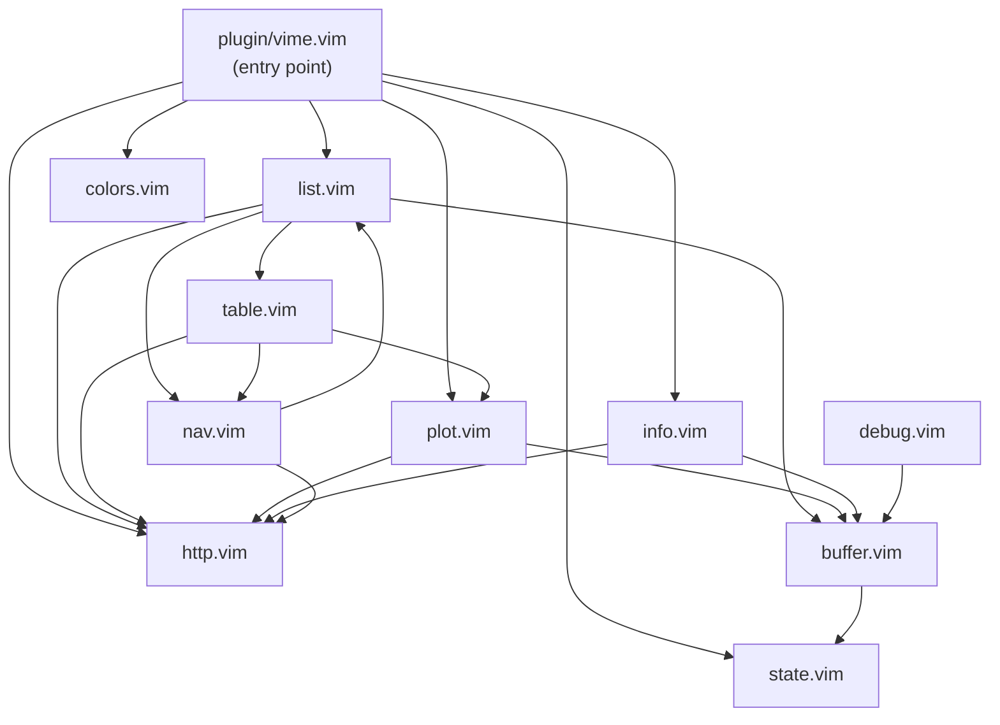

# VIME Vim Plugin

The Vim frontend for VIME. Provides commands, keybindings, and buffer management for browsing HDF5 files. All data operations are delegated to the Python backend over HTTP; the plugin handles only the UI layer.

## Module Diagram

## Module Overview

### plugin/vime.vim

Entry point for the plugin. Registers three user commands (`:VimeOpen`, `:VimePlot`, `:VimeInfo`), sets up autocommands to intercept `.h5` / `.hdf5` files via `BufReadCmd`, and sends a shutdown request to the backend on `VimLeave` when the server was started by the wrapper (`g:vime_owns_server`). Initializes the Nord highlight groups and stores the plugin directory in the shared state.

### autoload/vime/list.vim

Manages the **table list** buffer. When a file is opened, it sends an `open` command to the backend, receives the list of tables with row/column counts, and renders them in a bordered scratch buffer. Also handles background compute jobs: `,c` starts a compute via `compute_start`, then a Vim timer polls `compute_status` every second until the job completes or fails, refreshing the list on success.

### autoload/vime/table.vim

Manages the **table data** buffer. Sends a `table` command to the backend with the table name and optional row limit (`head`). The response contains pre-formatted tabulated text and a list of column names. Provides keybindings for plotting (`,p` prompts for column indices), toggling between head/all views, and navigating back to the list.

### autoload/vime/plot.vim

Manages the **plot** buffer. Sends a `plot` command to the backend with column references, plot type (line or scatter), and the window dimensions. The backend returns Unicode braille plot text which is rendered in a scratch buffer. Hides the status line for a cleaner plot view and restores it when the buffer is closed.

### autoload/vime/info.vim

Manages the **info** buffer. Sends an `info` command to the backend for a given table name and renders the returned metadata (shape, column types, numeric summary via `df.describe()`) in a bordered scratch buffer.

### autoload/vime/nav.vim

Navigation and buffer lifecycle manager. Provides functions to go back to the list (`back_to_list`), go back to the table (`back_to_table`), close the current buffer (`close_buf`), close all plot buffers (`close_plot_buffers`), and fully quit VIME (`quit` -- wipes all VIME buffers, stops the server, and opens an empty buffer).

### autoload/vime/http.vim

HTTP client layer. All server communication goes through `vime#http#send(payload)`, which JSON-encodes the payload, POSTs it to the backend using `curl`, and decodes the JSON response. The command name is extracted from the payload's `cmd` key and used as the URL path (`POST /{cmd}`). Also provides `ping()` for health checks and `stop_server()` for shutdown.

### autoload/vime/buffer.vim

Shared buffer utilities. `create_scratch(name, type, split)` creates a new nofile/noswap scratch buffer with an optional vertical or horizontal split. `set_content(lines)` replaces the buffer contents and locks it as nomodifiable. `render_content(content)` splits a string into lines and wraps them with Unicode box-drawing borders. `wrap_with_border(lines)` adds a `┏━┓ / ┃ ┃ / ┗━┛` frame around content lines.

### autoload/vime/colors.vim

Nord-based theme for all VIME buffers. `define()` creates highlight groups (called once at plugin load), and `apply()` sets per-buffer `winhighlight` and syntax rules for borders, headers, table names, dimensions, braille plot data, axis elements, grid lines, section titles, and the status bar.

**Highlight groups:**

| Group            | Purpose                              |
|------------------|--------------------------------------|
| `VimeNormal`     | Default text and background          |
| `VimeHeader`     | Header bar (inverted, bold)          |
| `VimeBorder`     | Box-drawing border characters        |
| `VimeTableName`  | Table path names (`/path/to/table`)  |
| `VimeTableDims`  | Dimension labels (`N rows x M cols`) |
| `VimePlotAxis`   | Plot axis lines and tick marks       |
| `VimePlotData`   | Braille plot data points             |
| `VimeFooter`     | Status bar                           |
| `VimeTitle`      | Section titles                       |
| `VimeMuted`      | De-emphasized text                   |
| `VimeGridLine`   | Table grid lines                     |

### autoload/vime/state.vim

Minimal key-value store for shared plugin state. Holds two keys: `current_file` (path of the currently open H5 file) and `plugin_dir` (path to the plugin installation directory). Accessed via `vime#state#get(key)` and `vime#state#set(key, val)`.

### autoload/vime/debug.vim

Debug log buffer with a 500-line rolling history. `vime#debug#log(line)` appends a timestamped line to the in-memory log and, if the debug buffer is visible, appends it there too. `vime#debug#toggle()` shows or hides the debug buffer as a horizontal split (5 lines tall). The log persists across toggle cycles.

## Buffer Types

Every VIME buffer has a `b:vime_type` variable set on creation, identifying its role:

| `b:vime_type` | Buffer          | Description                                      |
|----------------|-----------------|--------------------------------------------------|
| `list`         | Table list      | Lists all tables in the open H5 file             |
| `table`        | Table data      | Displays table rows in tabulated format           |
| `plot`         | Plot            | Renders a Unicode braille plot                    |
| `info`         | Info            | Shows table metadata and column statistics        |
| `debug`        | Debug log       | Rolling timestamped debug log                     |

Additional buffer-local variables set by specific buffer types:

- `b:vime_file` -- path to the H5 file (set on all VIME buffers)
- `b:vime_table_name` -- name of the table (set on `table` buffers)
- `b:vime_columns` -- list of column names (set on `table` buffers)
- `b:vime_table_map` -- line-number-to-table-name mapping (set on `list` buffers)
- `b:vime_status` -- status bar text (set on `list` buffers)

## Keybindings Reference

All keybindings are buffer-local and only active in the corresponding VIME buffer.

### List Buffer

| Key       | Action                                  |
|-----------|-----------------------------------------|
| `<Enter>` | Open the table under the cursor         |
| `,gv`     | Open table in a vertical split          |
| `,gh`     | Open table in a horizontal split        |
| `,s`      | Open `config.cfg`                       |
| `,i`      | Show info for the table under cursor    |
| `,r`      | Refresh the table list                  |
| `,c`      | Start a background compute job          |
| `,pdb`    | Toggle debug log buffer                 |
| `,q`      | Quit VIME (close all buffers + server)  |

### Table Buffer

| Key    | Action                                    |
|--------|-------------------------------------------|
| `,p`   | Plot prompt (enter x, y columns)          |
| `,pv`  | Plot in a vertical split                  |
| `,ph`  | Plot in a horizontal split                |
| `,pq`  | Close all plot buffers                    |
| `,b`   | Back to table list                        |
| `,h`   | Change head (show first N rows)           |
| `,a`   | Show all rows                             |
| `,i`   | Show table info                           |
| `,pdb` | Toggle debug log buffer                   |
| `,q`   | Close buffer                              |

### Plot Buffer

| Key    | Action                   |
|--------|--------------------------|
| `,b`   | Back to table            |
| `,q`   | Close plot               |
| `,pq`  | Close plot               |
| `,pdb` | Toggle debug log buffer  |

### Info Buffer

| Key    | Action                   |
|--------|--------------------------|
| `,b`   | Back to table list       |
| `,pdb` | Toggle debug log buffer  |
| `,q`   | Close buffer             |

### Debug Buffer

| Key    | Action                   |
|--------|--------------------------|
| `,pdb` | Toggle debug log buffer  |
| `,q`   | Close buffer             |

## Commands

| Command                             | Description                                         |
|--------------------------------------|-----------------------------------------------------|
| `:VimeOpen <file>`                  | Open an H5 file (supports file completion)          |
| `:VimePlot <col1> <col2> [type]`    | Plot two columns (type: `line` or `scatter`)        |
| `:VimeInfo`                         | Show info about the current table                   |

## Configuration

The following global Vim variables control the HTTP connection to the backend:

| Variable            | Default       | Description                          |
|---------------------|---------------|--------------------------------------|
| `g:vime_http_host`  | `127.0.0.1`   | Backend server host address          |
| `g:vime_http_port`  | `51789`        | Backend server port                  |
| `g:vime_curl_cmd`   | `curl`         | Path or name of the curl executable  |
| `g:vime_owns_server`| `0`            | Set by the launcher; if `1`, the plugin sends a shutdown request on `VimLeave` |

These are typically set automatically by the `vime` launcher script. Manual configuration is only needed when running the server independently.
