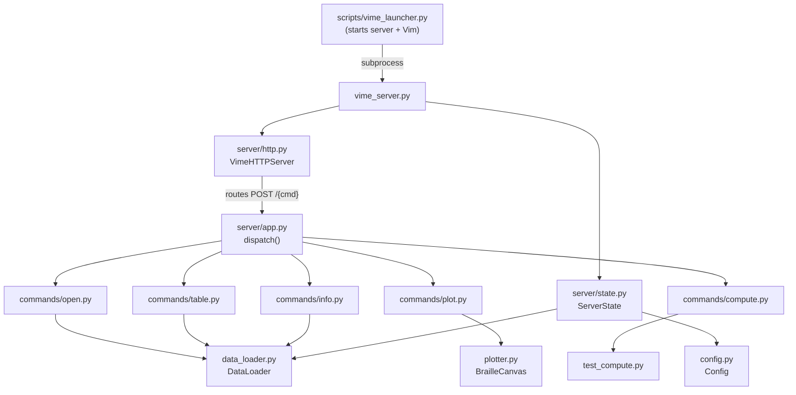
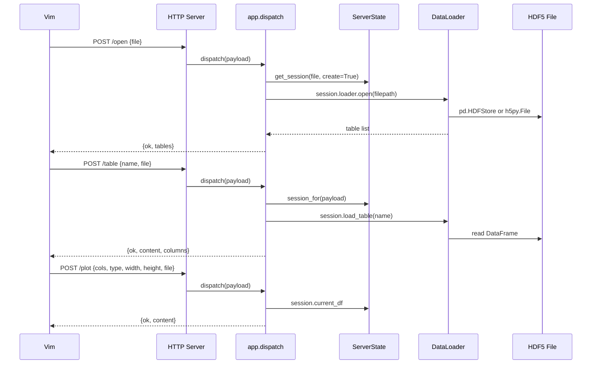

# VIME Python Backend

Persistent HTTP server that loads HDF5 files into memory and serves table data, metadata, and plots to the Vim frontend. Built on Python's `http.server` with a threaded handler, requiring no external web framework.

The server is a long-lived, shared daemon: it is started once (lazily, by the launcher) and reused by every Vim instance. State is isolated **per file** via `Session` objects keyed by file path, so multiple concurrent Vim instances do not clobber each other. The daemon shuts itself down after an idle period (`--idle-timeout` / `VIME_IDLE_TIMEOUT`), and heavy imports (pandas, h5py, numpy, tabulate, scikit-learn) are deferred until first use to minimize startup latency.

## Architecture


```mermaid
flowchart TD
    Launcher["scripts/vime_launcher.py<br>(starts server + Vim)"]
    Launcher -->|subprocess| Server

    Server[vime_server.py] --> HTTPLayer["server/http.py<br>VimeHTTPServer"]
    Server --> StateObj["server/state.py<br>ServerState"]

    HTTPLayer -->|"routes POST /{cmd}"| Dispatch["server/app.py<br>dispatch()"]

    Dispatch --> CmdOpen["commands/open.py"]
    Dispatch --> CmdTable["commands/table.py"]
    Dispatch --> CmdPlot["commands/plot.py"]
    Dispatch --> CmdInfo["commands/info.py"]
    Dispatch --> CmdCompute["commands/compute.py"]

    CmdOpen --> Loader["data_loader.py<br>DataLoader"]
    CmdTable --> Loader
    CmdInfo --> Loader
    CmdPlot --> PlotEngine["plotter.py<br>BrailleCanvas"]
    CmdCompute --> TestCompute["test_compute.py"]

    StateObj --> Loader
    StateObj --> ConfigMgr["config.py<br>Config"]
```

## Data Flow


```mermaid
sequenceDiagram
    participant Vim
    participant HTTP as HTTP Server
    participant Dispatch as app.dispatch
    participant State as ServerState
    participant Loader as DataLoader
    participant HDF5 as HDF5 File

    Vim->>HTTP: POST /open {file}
    HTTP->>Dispatch: dispatch(payload)
    Dispatch->>State: get_session(file, create=True)
    Dispatch->>Loader: session.loader.open(filepath)
    Loader->>HDF5: pd.HDFStore or h5py.File
    Loader-->>Dispatch: table list
    Dispatch-->>Vim: {ok, tables}

    Vim->>HTTP: POST /table {name, file}
    HTTP->>Dispatch: dispatch(payload)
    Dispatch->>State: session_for(payload)
    Dispatch->>Loader: session.load_table(name)
    Loader->>HDF5: read DataFrame
    Dispatch-->>Vim: {ok, content, columns}

    Vim->>HTTP: POST /plot {cols, type, width, height, file}
    HTTP->>Dispatch: dispatch(payload)
    Dispatch->>State: session.current_df
    Dispatch-->>Vim: {ok, content}
```

## Class and Module Overview

### vime_server.py

Server entry point. Parses CLI arguments (`--host`, `--port`, `--port-retries`, `--idle-timeout`), creates a `ServerState`, builds the HTTP handler via `make_handler()`, binds the server with port fallback, starts the idle watcher thread, and runs `serve_forever()`. Handles graceful shutdown on `KeyboardInterrupt`. `start_idle_watcher()` runs a daemon thread that compares `time.monotonic() - state.last_activity` against the idle timeout and calls `httpd.shutdown()` when it is exceeded (`--idle-timeout 0` disables it).

### ServerState (`server/state.py`)

Manager object passed to all command handlers. Holds a dict of per-file `Session` objects (an `OrderedDict` in LRU order), the shared `Config`, a lock, and the `last_activity` timestamp used by the idle watcher.

| Attribute        | Type                  | Description                                            |
|------------------|-----------------------|--------------------------------------------------------|
| `sessions`       | `OrderedDict`         | Normalized file path -> `Session` (LRU order)          |
| `max_sessions`   | `int`                 | Max files kept open (`VIME_MAX_SESSIONS`, default 16)  |
| `last_activity`  | `float`               | `time.monotonic()` of the last request                 |
| `config`         | `Config` or `None`    | Shared column ordering configuration                   |

Key methods:
- `get_session(path, create=False)` -- returns the `Session` for a path, creating it (and evicting + closing the LRU session beyond `max_sessions`) when requested; touches LRU order.
- `session_for(payload, create=False)` -- resolves the session from a request's `file` field.
- `mark_activity()` -- resets the idle timer (called on every request via the HTTP layer).
- `close_handles()` -- closes file handles for all sessions (used on shutdown).

### Session (`server/state.py`)

Per-file state, keyed by normalized file path:

| Attribute         | Type                      | Description                                        |
|-------------------|---------------------------|----------------------------------------------------|
| `filepath`        | `str`                     | Original file path for this session                |
| `loader`          | `DataLoader`              | HDF5 file reader                                   |
| `current_df`      | `DataFrame` or `None`     | Last-loaded table (used by plot)                   |
| `current_table`   | `str` or `None`           | Name of the last-loaded table                      |
| `virtual_tables`  | `dict`                    | Tables created by compute jobs                     |
| `compute_thread`  | `Thread` or `None`        | Background compute thread                          |
| `compute`         | `JobState`                | Current compute job status                         |
| `plot_thread`     | `Thread` or `None`        | Background plot thread                             |
| `plot`            | `JobState`                | Current plot job status                            |

Key methods:
- `ensure_open()` -- reopens the file handle if it was closed by LRU eviction (makes eviction transparent).
- `load_table(name)` -- loads from virtual tables first, then falls back to the file-backed loader.
- `get_table_list()` -- merges file-backed tables with virtual tables.
- `close()` -- closes this session's HDF5 file handles.

### JobState / JobStatus (`server/state.py`)

Tracks background job progress (shared by both compute and plot jobs). `JobStatus` is an enum with values: `IDLE`, `RUNNING`, `DONE`, `ERROR`. `JobState` is a dataclass holding the status, a message, a `result` payload (the plot content or the new virtual table's name, on success), and an optional error string (on failure).

### DataLoader (`data_loader.py`)

Reads HDF5 files using a dual-backend strategy:

1. **Pandas HDFStore** (preferred) -- tried first. Works for files created with `pd.to_hdf()`. Provides column names, dtypes, and indexes natively.
2. **h5py fallback** -- used when the pandas backend finds no tables or fails. Handles generic HDF5 datasets by converting structured arrays, scalars, 1-D, 2-D, and higher-dimensional arrays into DataFrames.

Key methods:

| Method              | Description                                              |
|---------------------|----------------------------------------------------------|
| `open(filepath)`    | Opens the file, selects a backend, returns table list    |
| `close()`           | Closes all file handles                                  |
| `list_tables()`     | Returns list of `{name, rows, cols}` dicts               |
| `load_table(name)`  | Reads a table as a pandas DataFrame                      |

### Config (`config.py`)

Manages per-table column ordering stored in `config.json` at the project root. When a table is loaded, `merge_table_columns()` preserves any user-defined column order and appends newly discovered columns. Changes are persisted atomically (write to `.tmp`, then `os.replace`).

### BrailleCanvas / braille_plot (`plotter.py`)

Unicode braille plotting engine. Each character cell encodes a 2x4 sub-pixel grid using braille characters (U+2800--U+28FF), giving 2x horizontal and 4x vertical resolution compared to regular character plots.

`BrailleCanvas` provides:
- `set_pixel(px, py)` -- set a sub-pixel
- `line(x0, y0, x1, y1)` -- draw a line using Bresenham's algorithm
- `render()` -- return the canvas as a list of strings

`braille_plot(x, y, ...)` is the high-level function that:
1. Computes data bounds and margins
2. Maps data coordinates to sub-pixel coordinates
3. Draws points (scatter) or connected line segments (line, sorted by x)
4. Adds y-axis labels, x-axis ticks, and axis labels

### VimeHTTPServer / VimeHandler (`server/http.py`)

Threaded HTTP server (`ThreadingHTTPServer` subclass) with strict port exclusivity (`allow_reuse_address = False`). The handler class is created dynamically by `make_handler(dispatch_fn, mark_activity_fn)` to capture the dispatch and idle-reset callbacks in a closure. Every request (including `GET /health`) calls `mark_activity_fn` to reset the idle timer.

Routes:
- `GET /health` -- returns `{"ok": true}` (also used as the Vim keepalive ping)
- `POST /{cmd}` -- extracts the command from the URL path, parses the JSON body, injects `cmd` into the payload, and calls `dispatch_fn`

`bind_http_server(host, start_port, max_attempts, handler_cls)` tries binding to sequential ports starting from `start_port`, incrementing on `EADDRINUSE` up to `max_attempts` times.

### dispatch (`server/app.py`)

Routes command names to handler functions:

| Command           | Handler                    |
|-------------------|----------------------------|
| `open`            | `commands.open.handle`     |
| `list_tables`     | `commands.list_tables.handle` |
| `table`           | `commands.table.handle`    |
| `info`            | `commands.info.handle`     |
| `plot_start`      | `commands.plot.handle_start` |
| `plot_status`     | `commands.plot.handle_status` |
| `compute_start`   | `commands.compute.handle_start` |
| `compute_status`  | `commands.compute.handle_status` |

All handlers receive `(state, payload)` and return a dict. Each handler resolves its `Session` from `payload["file"]` via `state.session_for(...)`, so requests other than `open` must include the `file` field. Exceptions are caught and returned as `{"ok": false, "error": "..."}`.

### NumpyEncoder (`server/formatters.py`)

`NumpyEncoder` is a `json.JSONEncoder` subclass that transparently converts `np.integer`, `np.floating`, `np.bool_`, and `np.ndarray` to native Python types. Used for all JSON responses.

### Command Handlers (`server/commands/`)

#### open.py

Validates the file path, gets-or-creates the `Session` for it (`state.get_session(file, create=True)`), opens the file if it is not already open, and returns `{"ok": true, "tables": [...]}`.

#### table.py

Resolves the session from `payload["file"]`, ensures the file is open, loads a table by name as a DataFrame, applies column config ordering, formats with `tabulate` (plain format, imported lazily), and returns the formatted text with a header line showing shape info.

#### plot.py

Generates a braille plot from the session's currently loaded DataFrame (`session.current_df`). Resolves column references (by integer index or string name), converts to float, removes NaN pairs, and calls `braille_plot()` (numpy and the plotter are imported lazily). Returns the plot as a string. Plot jobs run per session.

#### info.py

Resolves the session, loads a table, and returns metadata: table name, shape (`rows x cols`), column names with dtypes, and a numeric summary (`df.describe()`). Formatted with `tabulate` (numpy and tabulate imported lazily).

#### compute.py

Manages background compute jobs per session. `handle_start` checks that no job is already running for the session, then launches `test_compute()` (imported lazily) in a daemon thread. The thread stores its result as a virtual table in `session.virtual_tables` under a timestamped name (`/__computed__/compute_YYYYMMDD_HHMMSS`). `handle_status` returns the session's current `JobState` so the Vim plugin can poll for completion.

## HTTP API Reference

All command endpoints accept `POST` with a JSON body and return JSON. Every response includes an `ok` boolean field. All commands except `/health` must include a `file` field identifying the session (the open file's path); the examples below omit it for brevity except where noted.

### GET /health

Health check. Returns `{"ok": true}` when the server is running.

### POST /open

Open an HDF5 file and return its table list.

**Request:**
```json
{"file": "/path/to/data.h5"}
```

**Response:**
```json
{
  "ok": true,
  "tables": [
    {"name": "/experiment/results", "rows": 1000, "cols": 5},
    {"name": "/summary", "rows": 50, "cols": 3}
  ]
}
```

### POST /table

Load a table and return its formatted content.

**Request:**
```json
{"name": "/experiment/results", "file": "/path/to/data.h5"}
```

| Field  | Type   | Default | Description                                |
|--------|--------|---------|--------------------------------------------|
| `name` | string | --      | Table path within the HDF5 file            |
| `file` | string | --      | Path identifying the session               |

**Response:**
```json
{
  "ok": true,
  "content": "/experiment/results  [1000 rows x 5 cols]\n\ncol_a  col_b  ...",
  "columns": ["col_a", "col_b", "col_c"],
  "name": "/experiment/results"
}
```

### POST /plot_start

Start a background braille-plot job from the currently loaded table. Poll `/plot_status` for the result.

**Request:**
```json
{"cols": [0, 1], "type": "line", "width": 72, "height": 20, "file": "/path/to/data.h5"}
```

| Field    | Type        | Default  | Description                              |
|----------|-------------|----------|------------------------------------------|
| `cols`   | list        | --       | Two column references (index or name)    |
| `type`   | string      | `"line"` | Plot type: `"line"` or `"scatter"`       |
| `width`  | int         | `72`     | Plot width in characters                 |
| `height` | int         | `20`     | Plot height in character rows            |
| `file`   | string      | --       | Path identifying the session             |

**Response:**
```json
{"ok": true, "status": "running", "message": "Generating plot..."}
```

### POST /plot_status

Poll the current plot job status. When `status` is `"done"`, the response includes a `content` field with the rendered plot.

**Response (done):**
```json
{
  "ok": true,
  "status": "done",
  "message": "Plot done",
  "error": null,
  "content": "Plot: col_a vs col_b  (/experiment/results)\n\n..."
}
```

### POST /info

Return metadata for a table.

**Request:**
```json
{"name": "/experiment/results", "file": "/path/to/data.h5"}
```

**Response:**
```json
{
  "ok": true,
  "content": "Table: /experiment/results\nShape: 1000 rows x 5 cols\n..."
}
```

### POST /compute_start

Start a background compute job.

**Request:**
```json
{"file": "/path/to/data.h5"}
```

**Response:**
```json
{"ok": true, "status": "running", "message": "Computing..."}
```

### POST /compute_status

Poll the current compute job status.

**Response (running):**
```json
{"ok": true, "status": "running", "message": "Computing...", "table": null, "error": null}
```

**Response (done):**
```json
{"ok": true, "status": "done", "message": "Compute done: /__computed__/compute_20260213_120000", "table": "/__computed__/compute_20260213_120000", "error": null}
```

**Response (error):**
```json
{"ok": true, "status": "error", "message": "Compute failed", "table": null, "error": "..."}
```

## Launcher (`scripts/vime_launcher.py`)

Cross-platform launcher that orchestrates the server and Vim lifecycle:

1. **Check for existing server** -- scans the port range for a healthy, already-running daemon (`GET /health`) and reuses it if found.
2. **Start server** (if needed) -- spawns `vime_server.py` **detached** so it outlives the launcher and Vim. On Windows, uses `CREATE_NEW_PROCESS_GROUP | DETACHED_PROCESS`; on POSIX, `start_new_session=True`. Passes `--idle-timeout`.
3. **Wait for health** -- polls until the server responds healthy or a timeout expires (default 30s).
4. **Launch Vim** -- runs `vim` with `--cmd` arguments to set `g:vime_http_host` and `g:vime_http_port`.
5. **Exit** -- after Vim exits, the launcher returns and the daemon is intentionally **left running**. It reaps itself via its idle timeout.

### Environment Variables

| Variable                       | Default      | Description                              |
|--------------------------------|--------------|------------------------------------------|
| `VIME_PYTHON`                  | `sys.executable` | Python interpreter to run the server |
| `VIME_HTTP_HOST`               | `127.0.0.1`  | Host address for the server              |
| `VIME_HTTP_PORT`               | `51789`      | Starting port number                     |
| `VIME_HTTP_PORT_RETRIES`       | `100`        | Number of sequential ports to try        |
| `VIME_SERVER_STARTUP_TIMEOUT`  | `30`         | Seconds to wait for server health        |
| `VIME_IDLE_TIMEOUT`            | `900`        | Idle seconds before the daemon self-exits (`0` disables) |
| `VIME_MAX_SESSIONS`            | `16`         | Max files kept open in memory (LRU eviction beyond this) |

## Running the Server Standalone

The server can be started independently of the wrapper for development or testing:

```bash
cd python
python vime_server.py --host 127.0.0.1 --port 51789 --idle-timeout 0
```

(`--idle-timeout 0` disables the self-shutdown, convenient while developing.)

Then connect Vim manually:

```vim
let g:vime_http_host = '127.0.0.1'
let g:vime_http_port = 51789
:VimeOpen /path/to/data.h5
```
